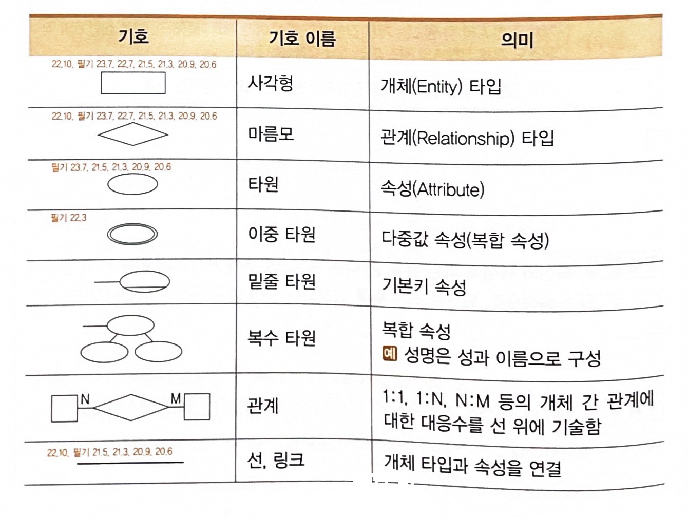
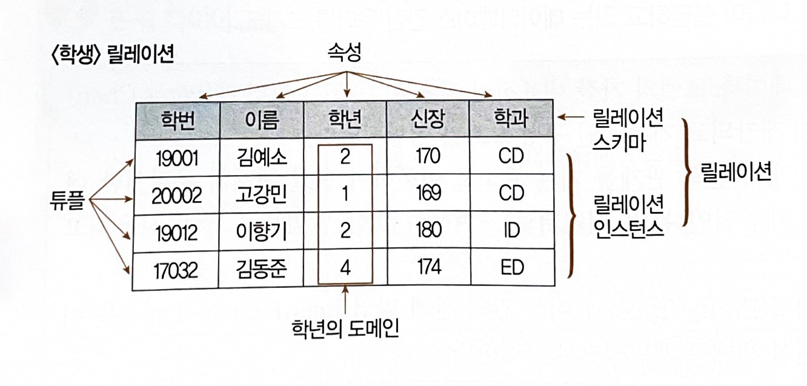

<link rel="stylesheet" href="../style.css">

# DB

1. 데이터베이스 개요

 

### 1) 데이터저장소

> 정의 : 데이터를 논리적인 구조로 조직화 or 물리적인 공간에 구축한 것
>
> - 논리 데이터저장소 : 데이터, 데이터 간 연관성, 제약조건 식별 -> 논리적 구조로 조직화한 것
> - 물리 데이터저장소 : 논리 데이터저장소를 실제 저장장치에 저장한 것

 

### 2) 데이터베이스(Database)

> 정의 : 공동으로 사용될 데이터 / 중복을 배제하여 통합 / 저장장치에 저장 / 항상 사용할 수 있게 하는 운영 데이터
>
> - 4가지 구분
>    - 공용(Shared) 데이터
>    - 통합(Integrated) 데이터
>    - 저장(Stored) 데이터
>    - 운영(Operational) 데이터

 

### 3) DBMS (DataBase Management System, 데이터베이스 관리 시스템)

> 정의 : 사용자 요구에 따라 정보를 생성해주고, DB 관리해주는 소프트웨어 (데이터의 종속성, 중복성 문제 해결)
>
> - 필수 기능 3가지
>    - 정의(Definition) : 데이터 형(type)과 구조 정의, 이용 방식, 제약 조건 등 명시
>    - 조작(Manipulation) : 데이터 검색, 갱신, 삽입, 삭제 위한 인터페이스 수단 제공
>    - 제어(Control) : 데이터 무결성, 보안, 권한 검사, 병행 제어 제공

 

### 4) 데이터의 독립성

> - 논리적 독립성 : 응용 프로그램과 DB 독립 => 데이터의 논리적 구조 변경시키더라도, 응용 프로그램에 영향 X
> - 물리적 독립성 : 응용 프로그램과 물리적 장치 독립 => 디스크 추가/변경 하더라도, 응용 프로그램에 영향 X

 

### 5) 스키마 (Schema)

정의 : DB 구조와 제약 조건에 관한 전반적인 명세를 기술한 것

- 스키마 3계층
    - 외부 스키마 : 사용자/응용 프로그래머가 각 개인 입장에서 필요로 하는 DB의 논리적 구조를 정의한 것
    - 개념 스키마
        - DB 전체 논리적 구조
        - 모든 사용자/응용 프로그램이 필요로 하는 데이터를 종합한 조직 전체의 DB
        - 하나만 존재
    - 내부 스키마
        - 물리적 저장장치의 입장에서 본 DB 구조
        - 실제로 저장될 레코드의 형식, 저장 데이터 항목의 표현 방법, 내부 레코드의 물리적 순서 등을 나타냄

 

2. 데이터베이스 설계

 

> 사용자 요구 분석 => DB 구조에 맞게 변형 => DBMS로 DB 구현 => 일반 사용자들이 사용하게 하는 것

 

### 1) 데이터베이스 설계 시 고려 사항

> - 무결성 : 삽입, 삭제, 갱신 등 연산 후에도 DB에 저장된 데이터가 정해진 제약 조건을 항상 만족
> - 일관성 : DB에 저장된 데이터 간 or 특정 질의에 대한 응답이 변함 없이 일정
> - 회복 : 시스템 장애 발생 시, 장애 직전 상태로 복구 가능
> - 보안 : 불법적인 데이터 노출, 변경, 손실로부터 보호 가능
> - 효율성 : 응답 시간 단축, 시스템 생산성, 저장 공간 최적화 등 가능
> - DB 확장 : DB 운영에 영향 없이 지속적으로 데이터 추가 가능

 

### 2) 데이터베이스 설계 순서

> - 요구 조건 분석 : 요구 조건 명세서 작성
> - 개념적 설계 : 개념 스키마, 트랜잭션 모델링, E-R 모델
> - 논리적 설계 : 목표 DBMS에 맞는 논리 스키마 설계, 트랜잭션 인터페이스 설계
> - 물리적 설계 : 목표 DBMS에 맞는 물리적 구조의 데이터로 변환
> - DB 구현 : 목표 DBMS의 DDL(데이터 정의어)로 DB 생성, 트랜잭션 작성

 

### 3) 요구 조건 분석

> 개념 : DB 사용할 사람들로부터 필요한 용도를 파악하는 것
>
> - 사용자에 따른 수행 업무, 필요 데이터의 종류/용도/처리 형태/흐름/제약 조건 등 수집
> - 요구 조건 명세서 작성

 

### 4) 개념적 설계 (정보 모델링, 개념화)

> - 현실 세계에 대한 인식을 추상적 개념으로 표현하는 과정
> - 개념 스키마 모델링, 트랜잭션 모델링
> - 요구 조건 명세를 DBMS에 독립적인 E-R 다이어그램으로 작성
> - DBMS에 독립적인 개념 스키마 설계

 

### 5) 논리적 설계 (데이터 모델링)

> - 현실 세계에서 발생하는 자료를 => 특정 DBMS가 지원하는 논리적 자료 구조로 변환(mapping)
> - 개념 세계의 데이터 => (필드로 기술된 데이터 타입 & 그들의 관계로 표현되는 논리적 구조의) 데이터로 모델화
> - 정규화 통해 개념 스키마 평가/정제 => DBMS에 따라 서로 다른 논리적 스키마 설계
> - 트랜잭션 인터페이스 설계

 

### 6) 물리적 설계 (데이터 구조화)

> - 논리적 구조로 표현된 데이터 => 물리적 구조의 데이터로 변환
> - DB 파일의 저장 구조 및 액세스 경로 설정
> - 저장 레코드의 형식, 순서, 접근 경로, 조회 집중 레코드 등의 정보 사용 => 데이터가 컴퓨터에 저장되는 방법 묘사

 

### 7) DB 구현

> - (논리적, 물리적 설계에서 도출된) DB 스키마를 파일로 생성하는 과정
> - 사용하려는 특정 DBMS의 DDL(데이터 정의어) 이용해 DB 스키마 기술 => 컴파일 => 빈 DB 파일 생성
> - (응용 프로그램을 위한) 트랜잭션 작성
> - (DB 접근을 위한) 응용 프로그램 작성

 

3. 데이터 모델의 개념

 

### 1) 데이터 모델

> 정의 : 현실 세계의 정보들을 체계적으로 표현한 개념적 모형
>
> - 데이터, 데이터의 관계, 데이터의 의미 및 일관성, 제약 조건 등을 기술하기 위한 개념적 도구들로 구성
> - DB 설계 과정에서 데이터 구조(schema)를 논리적으로 표현하기 위해 지능적 도구로 사용됨

 

> - 구성요소 : 개체(Entity) / 속성(Attribute) / 관계(Relationship)
>
> - 종류 : 개념적 / 논리적 / 물리적
>
> - 표시할 요소 : 구조 / 연산 / 제약 조건

 

### 2) 개념적 데이터 모델

> - 현실 세계에 대한 인식 => 추상적 개념으로 표현하는 과정
> - 속성들로 기술된 개체 타입 & 그들 간 관계 이용 => 현실 세계 표현
> - 현실 개체 => (인간이 이해할 수 있는) 정보 구조로 표현하므로, 정보 모델 이라고도 함
> - ex) E-R 모델

 

### 3) 논리적 데이터 모델

> - (개념적 데이터 모델링 과정에서 얻은) 개념적 구조 => 컴퓨터 환경에 맞도록 변환하는 과정
> - 필드로 기술된 데이터 타입 & 그들 간 관계 이용 => 현실 세계 표현
> - 단순 데이터 모델 = 논리적 데이터 모델
> - 특정 DBMS = 특정 논리적 모델 하나만 선정하여 사용
> - 데이터 간 관계를 어떻게 표현하느냐에 따라 구분
>    - 관계 모델
>    - 계층 모델
>    - 네트워크 모델

 

### 4) 물리적 데이터 모델

> - 실제 컴퓨터에 데이터가 저장되는 방법을 정의하는 물리 DB 설계 과정

 

### 5) 데이터 모델에 표시할 요소

> - 구조(Structure) : 논리적으로 표현된 개체 타입들 간의 관계 / 데이터 구조 및 정적 성질 표현
> - 연산(Operation) : DB에 저장된 실제 데이터를 처리하는 작업에 대한 명세 / DB 조작하는 기본 도구
> - 제약 조건(Constraint) : DB에 저장될 수 있는 실제 데이터의 논리적인 제약 조건

 

4. E-R(개체-관계) 모델

 

### 1) E-R(Entity-Relationship, 개체-관계) 모델

> 개념 : 개체 간의 관계를 이용, 현실 세계의 데이터 => 개념적인 논리 데이터로 표현하기 위한 방법
>
> - 1976년 피터 첸(Peter Chen)에 의해 제안됨
> - 개념적 데이터 모델의 가장 대표
> - 개체 타입(Entity Type) & 이들 간의 관계 타입(Relationship Type) 이용 => 현실 세계를 개념적으로 표현
> - 데이터를 개체(Entity), 관계(Relationship), 속성(Attribute)으로 묘사
> - E-R 다이어그램으로 표현 => 관계 유형(1:1 / N:M / 1:N) 제한 없이 표현 가능

 

> 💡 **개체 / 관계 / 속성**
>
> - 개체(Entity) : 실세계에서 개념적/물리적으로 존재하는 실제 대상체 (ex. 학생, 교수, 자동차 등)
> - 관계(Relationship) : 개체 사이의 관계를 표현 (ex. 교수는 학생을 지도하는 관계)
> - 속성(Attribute) : 개체 묘사에 사용되는 특성 (ex. 학생의 이름, 주소 등)

 

### 2) E-R 다이어그램

 

5. 관계형 DB의 구조 / 관계형 데이터 모델

 

### 1) 관계형 DB

> 개념 : 2차원 표(Table) 이용 => 데이터 상호 관계를 정의하는 DB
>
> - 1970년 IBM 근무하던 코드(E.F.Codd)에 의해 처음 제안됨
> - 개체(Entity)와 관계(Relationship)를 모두 릴레이션(Relation)이라는 표(Table)로 표현
>    - 개체 릴레이션
>    - 관계 릴레이션
>
> - 장점 : 간결하고 보기 편함, 다른 DB로 변환 용이
> - 단점 : 성능이 다소 떨어짐

 

### 2) 관계형 DB의 릴레이션 구조

> 릴레이션 : 데이터 => 표(Table) 형태로 표현한 것
>
> - 구성
>    - 릴레이션 스키마(구조)
>    - 릴레이션 인스턴스(실제 값)
>        - 데이터 **개체**를 구성하는 **속성**들에 **데이터 타입**이 정의되어 구체적인 데이터 **값**을 가진 것
>        - <학생> 릴레이션은 4개의 인스턴스 가짐

 

### 3) 튜플(Tuple)

> 개념 : 릴레이션 구성하는 각각의 행
>
> - 속성의 모임으로 구성
> - (파일 구조에서) 레코드와 같음
> - 튜플 수 = 카디널리티(Cardinality) = 기수 = 대응수
>    - <학생> 릴레이션의 카디널리티 = 4

 

### 4) 속성(Attribute)

> 개념 : DB를 구성하는 가장 작은 논리적 단위
>
> - (파일 구조 상의) 데이터 항목 or 데이터 필드
> - 개체 특성 기술
> - 속성 수 = 차수 = Degree
>    - <학생> 릴레이션의 디그리 = 5

 

### 5) 도메인(Domain)

> 개념 : 하나의 속성(Attribute)이 취할 수 있는 같은 타입의 원자(Atomic) 값들의 집합
>
> - 실제 속성 값의 적합 여부를 시스템이 검사하는 데에도 이용됨
> - ex) '성별' 속성의 도메인은 '남'과 '여' (그 외 입력 불가)

 

### 6) 릴레이션의 특징

> - 튜플은 모두 상이
> - 튜플 사이에 순서 X
>
> - 속성(릴레이션 스키마를 구성)들 간의 순서 중요 X
> - 속성 명칭은 유일해야 함
> - 속성의 값 = 원자 값(논리적으로 더 이상 쪼갤 수 X) / 속성을 구성하는 값은 동일할 수 O
>
> - (튜플을 유일하게 식별하기 위해) 속성들의 부분집합을 키(Key)로 설정
> - 릴레이션은 시간에 따라 변함 (튜플 삽입/삭제 등으로 인해)

 

### 7) 관계형 데이터 모델(Relational Data Model)

> 개념 : 테이블을 이용해 데이터 상호 관계를 정의하는 DB 구조 / DB에 저장된 데이터를 테이블 형태로 표현한 것
>
> - 가장 널리 사용
> - 테이블들을 하나의 DB로 묶어 => 테이블 내 속성 간 관계(Relationship) 설정 or 테이블 간 관계 설정하여 이용
> - 기본 키(Primary Key), 이를 참조하는 외래 키(Foreign Key)로 데이터 간 관계 표현
> - 계층 모델과 망 모델의 복잡한 구조를 단순화 시킨 모델
> - 대표 언어 = SQL
> - 관계(1:1 / N:M / 1:N) 자유롭게 표현 가능

 

6. 관계형 DB의 제약 조건 - 키(Key)

 

> 개념 : DB에서 조건에 만족하는 튜플 찾거나 or 순서대로 정렬할 때 기준이 되는 속성
>
> - 후보 키 (Candidate Key)
> - 기본 키 (Primary Key)
> - 대체 키 (Alternate Key)
> - 슈퍼 키 (Super Key)
> - 외래 키 (Foreign Key)

 

> 💡 **제약 조건**
>
> - 키(Key) 이용하여 입력되는 데이터를 제한하는 것
>
> - 목적 : DB에 저장되는 데이터 정확성을 보장하기 위해
> - 개체 무결성 제약, 참조 무결성 제약 등

 

### 1) 후보 키 (Candidate Key)

> 개념 : 기본 키로 사용 가능한 속성들 / (튜플을 유일하게 식별하기 위해 사용되는) 속성들의 부분 집합
>
> - 유일성(Unique) : 하나의 키 값으로 하나의 튜플을 유일하게 식별 가능
> - 최소성(Minimality) : 필요한 최소 속성으로 구성 (키를 구성하는 속성 하나 제거 시, 유일하게 식별 불가하도록)

 

### 2) 기본 키 (Primary Key)

> 개념 : 후보키 중 특별 선정된 주 키 (Main Key)
>
> - 중복된 값 X
> - 특정 튜플을 유일하게 구별할 수 있는 속성
> - NULL 값 불가

 

### 3) 대체 키 (Alternate Key)

> 개념 : 후보키 둘 이상일 때, 기본키를 제외한 나머지 후보키 (= 보조키)

 

### 4) 슈퍼 키 (Super Key)

> 개념 : 속성들의 집합으로 구성된 키
>
> - 릴레이션을 구성하는 모든 튜플 중 슈퍼키로 구성된 속성의 집합과 동일한 값 X
> - (릴레이션을 구성하는 모든 튜플에 대해) 유일성 O, 최소성 X

 

### 5) 외래 키 (Foreign Key)

> 개념 : 다른 릴레이션의 기본 키를 참조하는 속성 or 속성들의 집합
>
> - 외래 키 = 한 릴레이션에 속한 속성 A & 참조 릴레이션의 기본키 B => 동일한 도메인 상에서 정의되었을 때의 속성 A
> - **외래키**로 지정되면, 참조 릴레이션의 **기본키**에 없는 값은 입력 불가

 

7. 관계형 DB의 제약 조건 - 무결성(Integrity)

 

### 1) 무결성 (Integrity)

> 정의 : DB에 저장된 데이터 값 = 현실 세계의 실제 값  <-------- 일치하는 정확성

 

> 💡 **무결성 제약 조건**
>    - 부정확한 자료가 DB에 저장되는 걸 방지하기 위한 제약 조건
>    - 목적 : DB 데이터의 정확성 보장

 

### 2) 무결성 종류

> - **개체 무결성** : 기본키를 구성하는 어떤 속성도 NULL 또는 중복 값 가질 수 X
> - **참조 무결성** : 외래키 값은 NULL 또는 참조 릴레이션의 기본키 값과 동일해야 함
> - **도메인 무결성** : 속성 값이 정의된 도메인에 속한 값이어야 함
> - **사용자 정의 무결성** : 속성 값들이 사용자가 정의한 제약 조건에 만족되어야 함
> - **NULL 무결성** : 특정 속성 값이 NULL이 될 수 X
> - **고유 무결성** : 특정 속성에 대해 각 튜플이 갖는 속성 값들이 서로 달라야 함
> - **키 무결성** : 하나의 릴레이션에 적어도 하나의 키
> - **관계 무결성** : 릴레이션에 어느 한 튜플의 삽입 가능 여부 or 한 릴레이션과 다른 릴레이션의 튜플들 사이의 관계에 대한 적절성 여부를 지정한 규정

 

### 3) 데이터 무결성 강화

> **데이터 무결성**
>    - 데이터 품질에 영향을 미치므로, <u>데이터 특성에 맞는 적절한 무결성</u>을 정의/강화해야 함
>
>    - 애플리케이션, DB 트리거, 제약 조건을 이용해 강화 가능
>        - 애플리케이션 : 데이터 생성/수정/삭제 시, 무결성 조건을 검증하는 코드를 프로그램 내 추가
>        - DB 트리거 : 트리거 이벤트(데이터 입력/갱신/삭제)에 무결성 조건을 실행하는 절차형 SQL 추가
>        - 제약 조건 : DB에 제약 조건 설정 => 무결성 유지

 

8. 관계대수 및 관계해석

 

### 1) 관계 대수

> 개념 : 관계형 DB에서 원하는 정보 & 그 정보를 검색하기 위해 어떻게 유도하는가를 기술하는 절차적 언어
>
> - (릴레이션 처리 위해) 연산자, 연산 규칙 제공
> - 피연산자, 연산 결과 = 릴레이션
> - (해를 구하기 위해 수행해야 할) 연산 순서 명시
> - 순수 관계 연산자 / 일반 집합 연산자

 

### 2) 순수 관계 연산자

> - Select : σ (시그마)
>    - 수평 연산
>    - 튜플(행) 중 선택 조건을 만족하는 튜플의 부분 집합
>    
> - Project : π (파이)
>    - 수직 연산
>    - 릴레이션에서 속성(열) 리스트에 제시된 속성 값만 추출
>    - 중복은 제거됨
>
> - Join : ⨝
>    - 공통 속성 중심으로 두 개의 릴레이션을 하나로 합침
>    - 연산 결과 = 카다시안 곱(Cartesian Product, 교차 곱) 수행 후 + Select 수행한 것
>
> - Division : ÷
>    - X ⊃ Y인 두 개의 릴레이션 R(X), S(Y)가 있을 때, R의 튜플 중 S의 모든 속성 값을 포함하는 튜플에서 S가 가진 속성을 제외한 속성(X-Y)만을 구함
>    - S의 모든 값을 만족하는 튜플만 선택한 뒤, Projection(π)을 통해 결과 속성(X-Y) 추출

 

### 3) 일반 집합 연산자

> 💡 **합병 조건**
>
> 합집합, 교집합, 차집합 처리를 위해서는 합병 조건 만족해야 함
> - 두 릴레이션 간 속성 수 같고
> - 대응 속성별 도메인 같아야 함 (속성 이름은 달라도 됨)

 

> - 합집합 : UNION, ∪
>    - 튜플의 합집합을 구하되, 중복 튜플은 제거됨
>    - R ∪ S = { t | t ∈ R  ∨  t ∈ S } ----- (t는 릴레이션 R or S에 존재하는 튜플)
>    - 카디널리티(튜플 수) : |R ∪ S| ≤ |R| + |S|
>
> - 교집합 : INTERSECTION, ∩
>    - R ∩ S = { t | t ∈ R  ∧  t ∈ S } ----- (t는 릴레이션 R and S에 동시 존재하는 튜플)
>    - 카디널리티(튜플 수) : |R ∩ S| ≤ MIN { |R| , |S| }
>
> - 차집합 : DIFFERENCE, −
>    - R - S = { t | t ∈ R  ∧  t ∉ S} ----- (t는 릴레이션 R에는 존재 and S에는 없는 튜플)
>    - 카디널리티(튜플 수) : |R - S| ≤ |R|
>
> - 교차곱 : CARTESIAN PRODUCT, X
>    - 두 릴레이션에 존재하는 모든 튜플 대응시켜 새로운 릴레이션 만드는 연산
>    - 튜플들의 순서쌍 구하는 연산
>    - R X S = {r * s | r ∈ R  ∧  s ∈ S} ----- (r은 R에 있는 튜플 and s는 S에 있는 튜플)
>    - 카디널리티(튜플 수) : |R X S| = |R| X |S|

 

> 📌 **교차 곱의 연산 결과**
>    - 차수, degree(속성 수) = 두 릴레이션 속성 수의 합
>    - 카디널리티(튜플 수) = 두 릴레이션 튜플 수의 곱

 

### 4) 관계 해석 (Relational Calculus)

> 개념 : 관계 데이터의 연산을 표현하는 방법
>
> - '관계 데이터 모델' 제안자인 코드(E.F.Codd)가 관계 DB를 위해 제안
> - '원하는 정보가 무엇'인지만 정의하는 비절차적 특징
> - 원하는 정보 정의 시, 계산 수식 사용
> - 튜플 관계 해석 / 도메인 관계 해석

 

9. 이상 / 함수적 종속

 

### 1) 이상 (Anomaly)

> 💡 **이상 발생 원인 = 일부 속성들의 종속으로 인한 데이터 중복**

> 개념 : 테이블에서 일부 속성들의 종속 => 데이터 중복(Redundancy) 발생 => 테이블 조작 시 문제 발생하는 현상
>
> 종류
> - 삽입 이상 (Insertion Anomaly)
> - 삭제 이상 (Deletion Anomaly)
> - 갱신 이상 (Update Anomaly)

 

> - 삽입 이상
>    - 테이블에 데이터 삽입 시, (의도와 상관 없이 원하지 않은 값들로 인해) 삽입할 수 없게 되는 현상
>    - ex) <수강> 테이블의 기본 키 = 학번 + 과목번호 이므로, 학번과 학년만을 삽입하려 하면 '삽입 이상' 발생
>
> - 삭제 이상
>    - 테이블에서 한 튜플 삭제 시, 의도와 상관 없는 값들도 함께 삭제(연쇄 삭제)되는 현상
>    - ex) 학번 200인 학생이 과목번호 C123의 등록을 취소하고자 해당 튜플 삭제하면, 유지되어야 할 학년 정보까지 삭제됨 (정보 손실)
>
> - 갱신 이상
>    - 튜플에 있는 속성 값 갱신 시, 일부 튜플의 정보만 갱신되어, **정보 불일치성**이 생기는 현상
>    - ex) 학번 400인 학생의 학년을 4 -> 3으로 변경하려 하는데, 실수로 일부 튜플만 갱신 시, 정보 불일치성 발생

 

### 2) 함수적 종속 (Functional Dependency)

> 💡 **함수적 종속**
>
> - 데이터의 의미를 표현하는 것
> - (현실 세계를 표현하는) 제약 조건
> - DB에서 항상 유지되어야 할 조건

> 어떤 테이블 R이 있고, X와 Y는 각각 R의 속성 집합의 부분 집합이라고 할 때 / 속성 X의 값 각각에 대해 항상 속성 Y 값이 오직 하나만 연관된다면 ?
> 
> => Y는 X에 함수적 종속 = X가 Y를 함수적으로 결정한다 = X(결정자, Determinant) -> Y(종속자, Dependent)

> ex) 어떤 학생의 학번(X)이 정해지면 => (그에 대응하는) 이름, 학년, 학과(Y)는 오직 하나만 존재
>
> 이 때, 학번(X) = ('함수적 종속' 특성을 만족하므로) 기본 키 !

 

> **함수적 종속 - 3가지 종류**
>
> - 완전 함수적 종속(Full Functional Dependency)
>    - (학번, 과목번호) -> 성적
>    - 성적은 기본키인 (학번, 과목번호)에 완전 함수적 종속
>
> - 부분 함수적 종속(Partial Functional Dependency)
>    - 학번 -> 학년
>    - 학년은 기본키인 (학번, 과목번호)에 부분 함수적 종속
>
> - 이행적 함수적 종속(Transitive Functional Dependency)
>    - (X -> Y) & (Y -> Z) 일 때 => (X -> Z)

 

