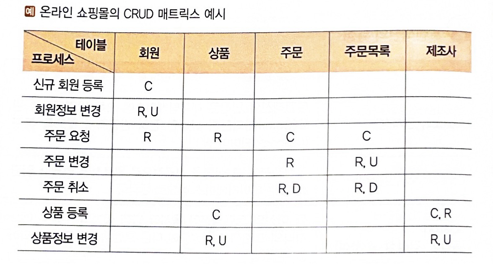
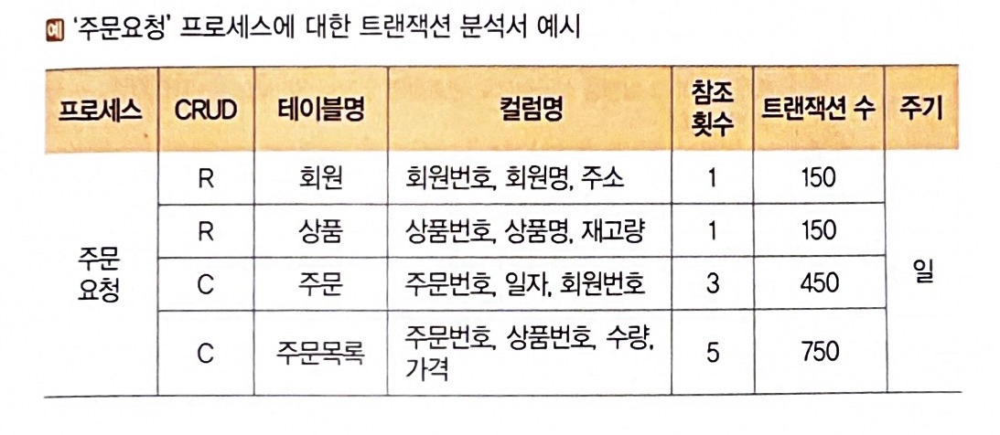
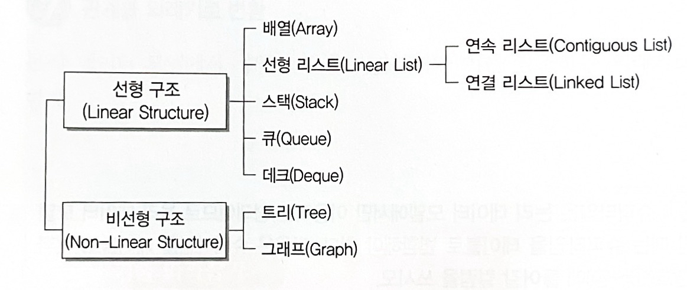
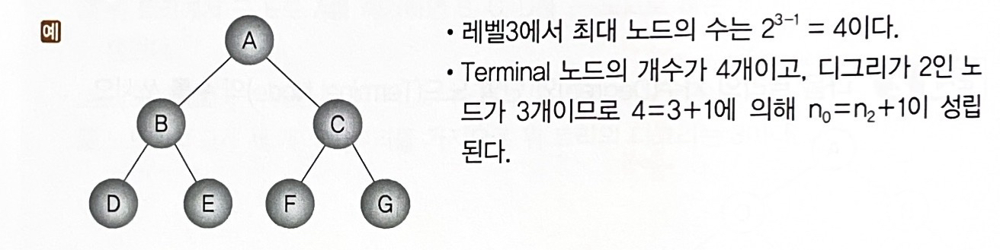

<link rel="stylesheet" href="../style.css">

# DB

1. 트랜잭션 분석 / CRUD 분석

 

### 1) 트랜잭션 (Transaction)

> **개념** : (DB 상태 변환시키는) 하나의 논리적 기능을 수행하기 위한 작업 단위 / 한번에 수행되어야 할 일련의 연산(데이터 처리 연산, CRUD) 집합
>
> **쓰임**
> - (DB 시스템에서) 병행 제어 및 회복 작업 시 처리되는 작업의 논리적 단위
> - (사용자가 시스템에 대한 서비스 요구 시) 시스템이 응답하기 위한 상태 변환 과정의 작업 단위

 

> 💡 **물리 DB 설계하려면 ?**
>
> DB에 어떤 트랜잭션이 얼마나 자주 발생하는지 분석 => 그에 따라 트랜잭션 처리 방법 or DB 구조 설계

 

### 2) 트랜잭션의 특성 (ACID)

> - **Atomicity (원자성)** : 트랜잭션 연산은 DB에 모두 반영되도록 완료(Commit)되든지, 전혀 반영되지 않도록 복구(Rollback) 되어야 함
>
> - **Consistency (일관성)** : 트랜잭션이 실행 성공하면, 일관성 있는 DB 상태로 변환함
>
> - **Isolation (독립성, 격리성, 순차성)** : 둘 이상의 트랜잭션이 병행 실행되는 경우, 어느 하나의 트랜잭션 실행 중 다른 트랜잭션 연산이 끼어들 수 X
>
> - **Durability (영속성, 지속성)** : 성공적으로 완료된 트랜잭션 결과는 (시스템이 고장나더라도) 영구 반영되어야 함

 

### 3) CRUD 분석

> **개념** : 프로세스 - 테이블 간 **CRUD 매트릭스** 만들어서 **트랜잭션을 분석**하는 것
>
> **장점** : CRUD 분석을 통해 트랜잭션 몰리는 테이블 파악 가능 => 디스크 구성 시 유용하게 활용 가능

 

> 💡 **CRUD 매트릭스**
> - 행(row)에는 프로세스 / 열(column)에는 테이블 => 프로세스가 테이블에 발생시키는 변화 표시 => 프로세스 - 데이터 간 관계 분석표
> - 트랜잭션이 테이블에 수행하는 작업 검증
> - 각 셀에는 C, R, U, D 들어감 (복수의 변화를 줄 때, 우선순위 : C > D > U > R)
>    - ex) '주문 변경' 프로세스는 R -> U 순으로 실행되지만, 표시 = U, R
> - 매트릭스 완성 => 아무것도 적히지 않은 행/열, C나 R 없는 열 확인 => 불필요/누락된 테이블/프로세스 찾는다.
> 

 

### 4) 트랜잭션 분석

> **목적** : **CRUD 매트릭스 기반**으로, 테이블에 발생하는 트랜잭션 양 분석 => 테이블에 저장되는 데이터 양 유추 => **DB 용량 산정 및 구조 최적화**
>
> **특징**
> - 업무 개발 담당자가 수행
> - 프로세스가 과도하게 접근하는 테이블 확인 가능 => 집중 접근 테이블을 여러 디스크에 분산 배치 => 디스크 입/출력 향상을 통한 성능 향상
>
> **트랜잭션 분석서**
> - 단위 프로세스, CRUD 매트릭스 이용하여 작성
> - 구성요소
>    - 단위 프로세스, CRUD 연산
>    - 테이블명, 컬럼명
>    - 테이블 참조 횟수, 트랜잭션 수, 발생 주기 등
>
> 

 

2. 인덱스

 

### 1) 인덱스 (Index)

> **개념** : 데이터 **레코드(튜플)를 빠르게 접근**하기 위해 <키 값, 포인터> 쌍으로 구성되는 데이터 구조
>
> **특징**
> - 레코드가 저장된 물리적 구조에 접근하는 방법 제공
> - 파일 레코드에 빠르게 액세스 가능
> - 레코드 삽입/삭제가 수시로 일어나는 경우, 인덱스 개수를 최소로 하는 게 효율적

 

### 2) 인덱스 종류

> 💡 인덱스를 구성하는 구조 or 특징에 따라 분류

> - **트리 기반 인덱스** : 인덱스 저장하는 블록들이 트리 구조
> - **비트맵 인덱스** : 인덱스 컬럼의 데이터 -> Bit 값(0 or 1)으로 변환하여 인덱스 키로 사용
> - **함수 기반 인덱스** : 컬럼 값 대신 컬럼에 특정 함수(function)나 수식(expression) 적용하여 산출된 값 사용
> - **비트맵 조인 인덱스** : 다수의 조인된 객체로 구성된 인덱스
> - **도메인 인덱스** : 개발자가 필요한 인덱스 직접 만들어 사용

 

### 3) 클러스터드/넌클러스터드 인덱스

> - **클러스터드 인덱스(Clustered Index)**
>    - 인덱스 키의 순서에 따라 데이터 정렬되어 저장ed
>    - 실제 데이터가 순서대로 저장 => 인덱스 검색 안해도 원하는 데이터 빠르게 찾을 수 O
>    - but, 데이터 삽입/삭제 시, 순서 유지를 위해 데이터 재정렬 필요
>
> - **넌클러스터드 인덱스(Non-Clustered Index)**
>    - 인덱스의 키 값만 정렬, 실제 데이터는 정렬 X
>    - 인덱스 검색하여 실제 데이터 위치 확인 필요 => 검색 속도 떨어짐
>    - but, 데이터 삽입/삭제 시, 재정렬 필요 없어 속도 빠름

 

3. 뷰 / 클러스터

 

### 1) 뷰 (View)

> **개념** : 하나 이상의 기본 테이블로부터 유도된, 이름을 가지는 **가상 테이블**
>
> **목적** : 사용자에게 접근 허용된 자료만 제한적으로 보여주기 위해
>
> **특징**
> - 저장장치 내에 물리적으로 존재 X, 사용자에게 있는 것처럼 간주됨
> - 정의 CREATE / 제거 DROP
> - (뷰를 통해서만 데이터에 접근하게 하면) 뷰에 나타나지 않는 데이터를 안전하게 보호하는 효율적인 기법
> - 뷰가 정의된 기본 테이블이나 뷰 삭제 시, 그를 기초로 정의된 다른 뷰도 자동 삭제

 

### 2) 뷰의 장/단점

> **장점**
> - 논리적 데이터 독립성 제공
> - (동일 데이터에 대해) 동시에 여러 사용자의 상이한 응용 or 요구 지원
> - 사용자의 데이터 관리를 간단하게 해줌
> - 접근 제어를 통한 자동 보안 제공
>
> **단점**
> - 독립적인 인덱스 가질 수 X
> - 뷰 정의 변경 불가
> - (뷰로 구성된 내용에 대한) 삽입/삭제/갱신 연산에 제약

 

### 3) 클러스터(Cluster)

> **개념** : 동일 성격의 데이터를 동일한 데이터 블록에 저장하는 물리적 저장 방법
>
> **목적** : 데이터 저장 시, 데이터 액세스 효율을 향상시키기 위해
>
> **특징**
> - 데이터 조회 속도 향상 <-> 입력/수정/삭제 성능 저하
> - 데이터 분포도가 넓을 수록 유리
> - 데이터 분포도 넓은 테이블을 클러스터링 하면 => 저장 공간 절약 가능
> - 단일 / 다중
>    - 처리 범위가 넓은 경우 => **단일 테이블 클러스터링**
>    - 조인 많이 발생하는 경우 => **다중 테이블 클러스터링**

 

> 💡 **분포도, 선택성(Selectivity)**
>
> = (조건에 맞는 레코드 수 / 전체 레코드 수) * 100
>
> '조건에 맞는 레코드 수' 적을수록 => 분포도 높다(넓다)

 

4. 파티션

 

### 1) 파티션(Partition)

> **개념** : 대용량 테이블 or 인덱스를 작은 논리적 단위인 파티션으로 나누는 것
>
> - 데이터 처리 => 테이블 단위
> - 데이터 저장 => 파티션 별

 

### 2) 파티션의 장/단점

> **장점**
> - 데이터 접근 시, 액세스 범위 줄여 => 쿼리 성능 향상
> - 데이터 분산 저장 => 디스크 성능 향상
> - 파티션 별로 백업 및 복구 수행 => 속도 빠름
> - 시스템 장애 시, 데이터 손상 최소화
> - 데이터 가용성 향상
> - 파티션 단위로 입/출력 분산 가능
>
> **단점**
> - 하나의 테이블을 세분화해 관리 => 세심한 관리 필요
> - 테이블 간 조인 비용 증가
> - 용량 작은 테이블에 파티셔닝 시 => 오히려 성능 저하

 

### 3) 파티션 종류

> 💡 물리 데이터 저장소의 파티션 설계에서 사용됨

> - **범위 분할 (Range Partitioning)**
>    - 지정한 열 값 기준으로 분할
>    - ex) 일별, 월별, 분기별
>
> - **해시 분할 (Hash Partitioning)**
>    - 지정한 열 값 기준으로 범위를 지정하여 분할
>    - 해시 함수 적용한 결과 값에 따라 데이터 분할
>    - (특정 파티션에 데이터 집중되는) 범위 분할의 단점 보완 => 데이터 고르게 분산 시 유용
>    - 특정 데이터 어디 있는 지 판단 불가
>    - 데이터가 고른 컬럼에 효과적 (ex. 고객번호, 주민번호)
>
> - **조합 분할 (Composite Partitioning)**
>    - 범위 분할 후 => 해시 분할
>    - 범위 분할한 파티션이 너무 커서 관리가 어려울 때 유용

 

5. 분산 DB 설계

 

### 1) DB 용량 설계

> **개념** : 데이터가 저장될 공간을 정의하는 것
>
> (테이블에 저장될) 데이터 양, 인덱스, 클러스터 등이 차지하는 공간 예측하여 반영해야 함
>
> **목적**
> - 용량을 정확히 산정 => 디스크 저장 공간 효과적으로 사용 & 확장성/가용성 높임
> - 디스크 특성 고려해 설계 => 디스크 입/출력 부하 분산 & 채널 병목 현상 최소화

 

### 2) 분산 DB 설계

> **분산 DB**
>    - 논리적으로는 하나의 시스템에 속하지만, 물리적으로는(네트워크를 통해 연결된) 여러 사이트에 분산된 DB
>    - 데이터 처리/이용 많은 지역에 DB 위치시켜 => 데이터 처리가 가능한 한 해당 지역에서 해결되도록 함
>
> **분산 DB 설계 목적**
>    - 애플리케이션 or 사용자가 분산되어 저장된 데이터에 접근하게 하는 것

 

### 3) 분산 DB 목표 - 투명성(위중한 병장)

> **위치 투명성(Location Transparency)**
>    - (액세스하려는 DB 실제 위치 알 필요 X) DB의 논리적 명칭만으로 액세스 가능
>
> **중복 투명성(Replication Transparency)**
>    - (동일 데이터가 여러 곳에 중복되어 있더라도) 사용자는 마치 하나의 데이터만 존재하는 것처럼 사용
>    - 시스템은 자동으로 여러 자료에 대한 작업 수행
>
> **병행 투명성(Concurrency Transparency)**
>    - (분산 DB 관련 여러 트랜잭션이 동시 실현되더라도) 그 트랜잭션의 결과는 영향 받지 X 
>
> **장애 투명성(Failure Transparency)**
>    - (트랜잭션, DBMS, 네트워크, 컴퓨터 장애에도 불구) 트랜잭션 정확하게 처리
>    - 특정 지역 장애 발생해도, 데이터 무결성 보장

 

### 4) 분산 설계 방법

> - **테이블 위치 분산** : DB 테이블을 각기 다른 서버에 분산 배치
>
> - **분할(Fragmentation)** : 테이블 데이터를 분할하여 분산
>    - **분할 규칙** : 완전성(Completeness) / 재구성(Reconstruction) / 상호 중첩 배제(Disjointness)
>    - **주요 분할 방법**
>        - 수평 분할 : (특정 속성 값 기준) 행(row) 단위 분할
>        - 수직 분할 : 데이터 컬럼(속성) 단위 분할
>
> - **할당(Allocation)** : 동일한 분할을 여러 개 서버에 생성하는 분산 방법
>    - 중복 없는 할당
>    - 중복 있는 할당

 

6. DB 이중화 / 서버 클러스터링

 

### 1) DB 이중화 (Database Replication)

> **개념** : **동일한 DB 복제**하여 관리하는 것
>
> **목적** : 시스템 오류로 인한 DB 서비스 중단 or 물리적 손상 발생 => 복구 위해
>
> **장점**
>    - 애플리케이션을 여러 DB에서 분산 처리하므로 => DB 부하 줄일 수 있음
>    - 손쉽게 백업 서버 운영 가능

 

> 💡 **(시스템 오류로 인한) DB 서비스 중단 막는 법**
>
> => DB 이중화 vs 서버 클러스터링 (차이점)
>
> - **DB 이중화** : 동일한 DB 복제
>    - 활동-대기(Active-Standby) 방법
>    - 활동-활동(Active-Active) 방법
> - **서버 클러스터링** : 두 대 이상의 서버를 하나의 서버처럼 운영
>    - 고가용성 클러스터링
>    - 병렬 처리 클러스터링

 

### 2) DB 이중화의 분류 - 변경 내용의 전달 방식에 따라

> - **Eager 기법**
>    - 트랜잭션 수행 중 데이터 변경 발생 => 모든 DB에 즉시 전달, 변경 내용 즉시 적용
>
> - **Lazy 기법**
>    - 트랜잭션 수행 종료 => 변경 사실 새로운 트랜잭션에 작성 => 각 DB에 전달
>    - DB마다 새로운 트랜잭션 수행되는 걸로 간주

 

### 3) DB 이중화 구성 방법

> - **활동-대기(Active-Standby) 방법**
>    - 한 DB가 활성 서비스 & 다른 DB는 대기 => 장애 발생 시, 자동으로 모든 서비스 대신 수행
>    - 구성 방법, 관리 쉬움 => 많은 기업에서 이용
>
> - **활동-활동(Active-Active) 방법**
>    - 두 개의 DB 서로 다른 서비스 제공 => 둘 중 하나 문제 발생 시 나머지 다른 DB가 서비스 제공
>    - 두 DB가 모두 일하니 처리율 높지만 / 구성 방법, 설정 복잡

 

### 4) 클러스터링(Clustering)

> **개념** : 두 대 이상의 서버를 하나의 서버처럼 운영하는 기술
>
> **특징** : 서버 이중화 및 공유 스토리지 사용하여, **서버 고가용성** 제공
>
> **종류**
>    - **고가용성 클러스터링**
>        - 하나의 서버에 장애 발생 시 => 다른 서버(노드)가 받아 처리해 서비스 중단 방지
>        - 일반적으로 언급되는 클러스터링
>
>    - **병렬 처리 클러스터링**
>        - (전체 처리율 높이기 위해) 하나의 작업을 여러 개 서버에서 분산 처리

 

### 5) RTO / RPO

> **RTO(Recovery Time Objective, 목표 복구 시간)**
>    - 비상/업무 중단 시점 ~ 복구되어 가동될 때까지 소요 시간
>    - 얼마나 빨리 복구되는지
>    - ex) 장애 발생 후, 6시간 내 복구 가능
>
> **RPO(Recovery Point Objective, 목표 복구 시점)**
>    - 비상/업무 중단 시점 ~ 데이터 복구 가능한 기준점
>    - 데이터가 얼마나 복구될 지
>    - ex) 지난 주 금요일에 백업시켜 둔 복원 시점으로 복구 가능

 

7. DB 보안

 

### 1) DB 보안

> **개념** : (DB 일부 or 전체에 대해) 권한 없는 사용자가 액세스하는 걸 금지하기 위한 기술

 

### 2) 암호화(Encryption)

> **암호화**
> - 암호화(Encryption) : 평문 => 암호문
> - 복호화(Decryption) : 암호문 => 평문
>
> **암호화 기법**
> - **개인키 암호 방식(Private Key Encryption)**
> - **공개키 암호 방식(Public Key Encryption)**

 

### 3) 접근통제

> **개념** : '데이터가 저장된 객체 <-> 이를 사용하려는 주체' 간 정보 흐름을 제한하는 것 (데이터 보호 방법)
>
> **접근통제 3요소**
> - 접근통제 정책
> - 접근통제 매커니즘
> - 접근통제 보안모델

 

> 💡 **접근통제 기술**
>
> - **임의 접근통제 (DAC, Discretionary Access Control)**
>    - **사용자 신원에 따라** 접근 권한 부여
>    - **데이터 소유자가** 접근통제 권한을 지정/제어
>    - 객체를 생성한 사용자가 생성된 객체에 대한 모든 권한 부여받고, 다른 사용자에게 권한 허가할 수도 있음
>
> - **강제 접근통제 (MAC, Mandatory Access Control)**
>    - **주체와 객체의 등급 비교**하여 접근 권한 부여
>    - **시스템이** 접근통제 권한 지정
>    - DB 객체별로 보안 등급 부여 가능 / 사용자별로 인가 등급 부여 가능
>
> - **역할기반 접근통제 (RBAC, Role Based Access Control)**
>    - **사용자 역할**에 따라 접근 권한 부여
>    - **중앙관리자가** 접근통제 권한 지정
>    - 다중 프로그래밍 환경에 최적화된 방식
>    - 임의 접근통제, 강제 접근통제의 단점 보완

 

### 4) 접근통제 정책

> **개념** : 어떤 주체가/언제/어디서/어떤 객체에게/어떤 행위에 대한 허용 여부를 정의하는 것
>
> **종류**
>
> - **신분 기반 정책** : 주체/그룹의 **신분**에 근거하여 객체 접근 제한
>    - IBP (Individual-Based Policy) : 최소 권한 정책 / 단일 주체에게 하나의 객체에 대한 허가 부여
>    - GBP (Group-Based Policy) : 복수 주체에 하나의 객체에 대한 허가 부여
>
> - **규칙 기반 정책** : 주체가 갖는 **권한**에 근거하여 객체 접근 제한
>    - MLP (Multi-Level Policy) : 사용자나 객체별로 지정된 기밀 분류에 따른 정책
>    - CBP (Compartment-Based Policy) : 집단별로 지정된 기밀 허가에 따른 정책
>
> - **역할 기반 정책** : 주체가 맡은 **역할**에 근거하여 객체 접근 제한
>    - GBP의 변형된 정책

 

### 5) 접근통제 매커니즘

> **개념** : 접근통제 정책을 구현하는 기술적인 방법
>
> **종류**
> - 접근통제 목록 (객체 기준)
> - 능력 리스트 (주체 기준)
> - 보안 등급
> - 패스워드
> - 암호화

 

### 6) 접근통제 보안 모델

> **개념** : 보안 정책 구현하기 위해 정형화된 모델
>
> **종류**
>
> - **기밀성 모델**
>    - 군사 목적으로 개발 / 군대 시스템 등 특수 환경에서 주로 사용
>    - 기밀성 보장 최우선
>    - 최초의 수학적 모델
>
> - **무결성 모델**
>    - (기밀성 모델에서 발생하는 불법적 정보 변경 방지 위해) 무결성 기반으로 개발
>
> - **접근통제 모델**
>    - 접근통제 매커니즘을 보안 모델로 발전시킨 것
>    - 대표적으로 **접근통제 행렬(Access Control Matrix)**
>        - '임의적 접근통제' 관리하기 위한 보안 모델
>        - 행 = 주체 / 열 = 객체 => 권한 유형 나타냄

 

### 7) 접근통제 조건

> **개념** : '접근통제 매커니즘'의 취약점 보완 위해 '접근통제 정책'에 부가하여 적용 가능한 조건
>
> - 값 종속 통제(Value-Dependent Control)
>    - 객체에 저장된 값에 따라 다르게 접근통제 허용해야 할 때
>
> - 다중 사용자 통제(Multi-User Control)
>    - 지정된 객체에 다수의 사용자가 동시 접근 요구하는 경우
>
> - 컨텍스트 기반 통제(Context-Based Control)
>    - 특정 시간, 네트워크 주소, 접근 경로, 인증 수준 등에 근거하여 접근 제어
>    - 다른 보안 정책과 결합해, 보안 시스템 취약점 보완 시 사용

 

### 8) 감사 추적

> **개념** : 사용자 or 애플리케이션이 DB에 접근하여 수행한 모든 활동 기록
>
> **목적** : 오류 발생 DB 복구 or 부적절한 데이터 조작 파악

 

8. DB 백업

 

### 1) DB 백업

> **개념** : 장애에 대비해 / DB에 저장된 데이터 보호, 복구하기 위한 작업

 

### 2) 로그 파일

> **개념** : (DB 처리 내용 or 이용 상황 등) 상태 변화를 시간 흐름에 따라 모두 기록한 파일
>
> **특징**
>
> - DB 복구 위해 필요한 가장 기본 자료
> - DB를 과거 상태로 **복귀(UNDO)** 시키거나, 현 상태로 **재생(REDO)** => DB 상태 일관성 있게 유지 가능
> - 트랜잭션 시작 시점, ROLLBACK 시점, 데이터 입력/수정/삭제 시점 등에서 기록됨

 

### 3) DB 복구 알고리즘

> - **NO-UNDO / REDO** : DB 버퍼 내용을 **비동기적으로 갱신**한 경우
>    - NO-UNDO : 트랜잭션 완료 전에는 변경 내용이 DB에 기록 X => 취소할 필요 X
>    - REDO : 트랜잭션 완료 후 DB 버퍼에는 기록 O & 저장매체에는 기록 X => 트랜잭션 다시 실행
>
> - **UNDO / NO-REDO** : DB 버퍼 내용을 **동기적으로 갱신**한 경우
>    - UNDO : 트랜잭션 완료 전에 시스템이 파손되었다면 => 변경 내용 취소
>    - NO-REDO : 트랜잭션 완료 전 DB 버퍼 내용을 이미 저장매체에 기록 => 트랜잭션 다시 실행 X
>
> - **UNDO / REDO** : DB 버퍼 내용을 **동기/비동기적으로 갱신**한 경우
>    - DB 기록 전 트랜잭션 완료될 수 있으므로, 완료된 트랜잭션이 DB에 기록되지 못했다면 => 트랜잭션 다시 실행
>
> - **NO-UNDO / NO-REDO** : DB 버퍼 내용을 **동기적으로** 저장매체에 기록, but DB와는 다른 영역에 기록한 경우
>    - NO-UNDO : 변경 내용이 DB와 다른 영역에 기록 => 취소할 필요 X
>    - NO-REDO : 다른 영역에 이미 기록되었으므로 => 트랜잭션 다시 실행 X

 

### 4) 백업 종류 - 복구 수준에 따라

> - **물리 백업**
>    - 운영체제 이용 
>    - DB 파일 백업
>    - 백업 속도 빠르고 작업 단순 <-> 문제 발생 시, 원인 파악 및 문제 해결 어려움
>
> - **논리 백업**
>    - DBMS 유틸리티 이용
>    - DB 내 논리적 객체들을 백업
>    - 복원 시 데이터 손상을 막고, 문제 발생 시 원인 파악 및 해결 수월 <-> 시간 많이 걸림

 

9. 스토리지(Storage)

 

> **개념** : 대용량 데이터 저장하기 위해 서버와 저장장치를 연결하는 기술
>
> **종류**
> - DAS
> - NAS
> - SAN

 

### 1) DAS (Direct Attached Storage)

> **개념** : 서버와 저장장치를 전용 케이블로 직접 연결 (컴퓨터에 외장하드 연결)
>
> **장점**
> - 속도 빠름, 설치 및 운영 쉬움
> - 초기 구축 비용 및 유지보수 비용 저렴
>
> **단점**
> - 다른 서버에서 접근 불가, 파일 공유 불가 => 확장성/유연성 떨어짐

 

### 2) NAS (Network Attached Storage)

> **개념** : 서버와 저장장치를 네트워크를 통해 연결 (별도 파일 관리 기능이 있는 NAS Storage가 내장된 저장장치를 직접 관리)
>
> **장점**
> - (Ethernet 스위치 통해) 다른 서버에서도 접근 가능 => 파일 공유 가능
> - (장소 상관 없이) 저장장치에 쉽게 접근 가능
> - (DAS에 비해) 확장성/유연성 우수

 

### 3) SAN (Storage Area Network)

> **개념** : 서버와 저장장치를 연결하는 전용 네트워크를 별도 구성 => 광 채널(FC) 스위치 이용해 네트워크 구성
>
> **장점**
> - DAS의 빠른 처리 + NAS의 파일 공유
> - 광 채널 스위치 : 서버-저장장치를 광케이블로 연결 => 처리 속도 빠름
> - 저장장치 공유 => 여러 개 저장자치나 백업 장비를 단일화 가능
> - 확장성/유연성/가용성 뛰어남

 

10. 자료구조

 

> **개념** : 자료를 기억장치 공간 내에 저장하는 방법, 자료 간 관계, 처리 방법 등을 연구 분석하는 것
>
> **목적** : 저장 공간 효울성, 실행시간 단축

> **자료 구조 분류**
>
> 

 

### 1) 배열(Array)

> **개념** : 크기와 형(Type)이 동일한 자료들이 순서대로 나열된 자료의 집합
>
> **특징**
> - 반복적인 데이터 처리 작업에 적합
> - 정적 자료 구조 => 기억장소 추가 어려움
> - 데이터 삭제 시, 기억장소가 빈 공간으로 남아 => 메모리 낭비

 

### 2) 연속 리스트(Contiguous List)

> **개념** : 연속되는 기억장소에 저장되는 자료구조
>
> **특징**
> - 데이터를 중간에 삽입하려면, 연속된 빈 공간이 있어야 함
> - 삽입/삭제 시 자료 이동 필요

 

### 3) 연결 리스트(Linked List)

> **개념** : 자료를 임의 기억공간에 기억시키되, 순서에 따라 노드의 포인터 부분 이용해 서로 연결시킨 자료구조
>
> **특징**
> - 연결을 위한 링크(포인터) 필요 => 기억 공간 이용 효율이 좋지 X
> - 접근 속도 느리고 / 연결 끊기면 다음 노드 찾기 어려움
> - 노드 = DATA | LINK

 

### 4) 스택(Stack)

> **개념** : 리스트 한쪽 끝으로만 삽입/삭제 이루어지는 자료 구조
>
> **특징**
> - 후입선출(LIFO; Last In First Out) 방식
> - 기억 공간 없는 상태에서 데이터 삽입 => 오버플로(Overflow) 발생
> - 삭제할 데이터 없는 상태에서 데이터 삭제 => 언더플로(Underflow) 발생

 

### 5) 큐(Queue)

> **개념** : 리스트 한쪽에서는 삽입, 다른 한쪽에서는 삭제 이뤄지는 자료 구조
>
> **특징**
> - 선입선출(FIFO; First In First Out)
> - 프런트 포인터(Front, 시작 표시), 리어 포인터(Rear, 끝 표시)

 

### 6) 그래프(Graph)

> **개념** : 정점(Vertex)과 간선(Edge)의 두 집합으로 이루어지는 자료 구조
>
> **특징**
> - 트리(Tree) : 사이클 없는 그래프
> - 간선 방향성 유무에 따라
>    - 방향 그래프
>    - 무방향 그래프

 

> 💡 **방향/무방향 그래프 - 최대 간선 수**
>
> n = 정점의 개수
>
> - 방향 그래프 = n(n-1)
> - 무방향 그래프 = n(n-1) / 2

 

11. 트리(Tree)

 

### 1) 트리

> **개념** : 정점(Node, 노드)과 선분(Branch, 가지) 이용하여 사이클을 이루지 않게 구성한 그래프(Graph)

 

### 2) 트리 관련 용어

> - **노드(Node)** : 트리의 기본 요소
>
> - **근 노드(Root Node)** : 최상단 노드
>
> - **디그리(Degree, 차수)** : 각 노드에서 뻗어나온 가지(Branch) 수
>
> - **단말 노드(Terminal Node) = 잎 노드(Leaf Node)** : 자식이 하나도 없는 노드 (Degree = 0)
>
> - **비단말 노드(Non-Terminal Node)** : 자식 하나라도 있는 노드 (Degree > 0)
>
> - **조상 노드(Ancestors Node)** : 임의 노드에서 근 노드에 이르는 경로 상에 있는 노드들
>
> - **자식 노드(Son Node)** : 어떤 노드에 연결된 다음 레벨 노드들
>
> - **부모 노드(Parent Node)** : 어떤 노드에 연결된 이전 레벨 노드들
>
> - **형제 노드(Brother Node, Sibling)** : 동일한 부모 갖는 노드들
>
> - **Level** : 근 노드 Level = 1
>
> - **깊이(Depth, Height)** : 트리에서 노드가 가질 수 있는 최대 Level
>
> - **숲(Forest)** : 여러 개의 트리가 모여 있는 것
>
> - **트리의 디그리** : 노드들의 디그리 중 가장 큰 수

 

12. 이진 트리(Tree)

 

### 1) 이진 트리

> **개념** : 차수(Degree) 2 이하인 노드들로 구성된 트리 (자식 둘 이하 노드로만 구성)
>
> - 레벨 i 에서의 최대 노드 수 = 2의 (i-1)승
> - 리프 노드 수(n0) = 차수 2인 노드 수(n2) + 1
>
> 

 

### 2) 트리 운행법(Traversal)

> **개념** : 트리 구성하는 각 노드들을 찾아가는 방법
>
> **종류**
>
> - Preorder : root => left => right (전위 표기법, Prefix) : ABDHIECFG
> - Inorder : left => root => right (중위 표기법, Infix) : HDIBEAFCG
> - Postorder : left => right => root (후위 표기법, Postfix) : HIDEBFGCA
>
> 

 

### 3) 수식 표기법

> - **Infix(중위) => Prefix(전위)**
>    - 연산 우선순위에 따라 괄호 묶기
>    - 연산자를 해당 괄호 앞으로 옮기고, 괄호 제거
>
> - **Infix(중위) => Postfix(후위)**
>    - 연산 우선순위에 따라 괄호 묶기
>    - 연산자를 해당 괄호 뒤로 옮기고, 괄호 제거

 

> - **Prefix(전위) => Infix(중위)**
>    - 인접한 피연산자 두 개와 왼쪽 연산자 괄호 묶기
>    - 연산자를 피연산자 사이로 이동, 괄호 제거
>
> - **Postfix(후위) => Infix(중위)**
>    - 인접한 피연산자 두 개와 오른쪽 연산자 괄호 묶기
>    - 연산자를 피연산자 사이로 이동, 괄호 제거

 

13. 정렬(Sort)

 

### 1) 삽입 정렬(Insertion Sort)

> **개념** : 이미 순서화된 파일에 새로운 하나의 레코드를 순서에 맞게 삽입
>
> **시간 복잡도** : 평균 = 최악 = O(n의 제곱)

 

### 2) 선택 정렬(Selection Sort)

> **개념** : n개 레코드 중 최소 값 찾아 첫 번째 위치에 놓고, 나머지 (n-1)개 중 다시 최소 값 찾아 두 번째 위치에 놓는 방식 반복
>
> **시간 복잡도** : 평균 = 최악 = O(n의 제곱)
>
> ✅ 앞에서부터 채움

 

### 3) 버블 정렬(Bubble Sort)

> **개념** : 인접한 두 개 레코드 키 값 비교 => 크기에 따라 위치를 서로 교환
>
> **시간 복잡도** : 평균 = 최악 = O(n의 제곱)
>
> ✅ 뒤에서부터 채움

 

### 4) 쉘 정렬(Shell Sort)

> **개념** : 입력 파일을 어떤 매개변수의 값으로 서브 파일 구성, 각 서브 파일을 '삽입 정렬' 방식으로 순서 배열하는 과정을 반복
>
> **시간 복잡도** : 평균 = O(n의 1.5승) / 최악 = O(n의 제곱)

 

### 5) 퀵 정렬(Quick Sort)

> **개념** : (키 기준) 작은 값은 왼쪽, 큰 값은 오른쪽 서브 파일에 분해시키는 과정 반복
>
> **특징** : 레코드의 많은 자료 이동 없애고, 하나의 파일을 부분적으로 나누어가며 정렬
>
> **시간 복잡도** : 평균 = O(nlog2의n승) / 최악 = O(n의 제곱)

 

### 6) 힙 정렬(Heap Sort)

> **개념** : 전이진트리(Complete Binary Tree) 이용한 방식 / 구성된 전이진트리를 Heap Tree로 변환하여 정렬
>
> **시간 복잡도** : 평균 = 최악 = O(nlog2의n승)

 

### 7) 2-Way 합병 정렬(Merge Sort)

> **개념** : 이미 정렬되어 있는 두 개의 파일 => 하나로 합병
>
> **시간 복잡도** : 평균 = 최악 = O(nlog2의n승)

 

### 8) 기수 정렬(Radix Sort) = Bucket Sort

> **개념** : Queue 이용하여 자릿수(Digit)별로 정렬
>
> **방식** : 레코드 키 값 분석 => 같은 수 or 문자끼리 그 순서에 맞는 버킷에 분배 => 버킷 순서대로 꺼내 정렬
>
> **시간 복잡도** : 평균 = 최악 = O(dn)

 

